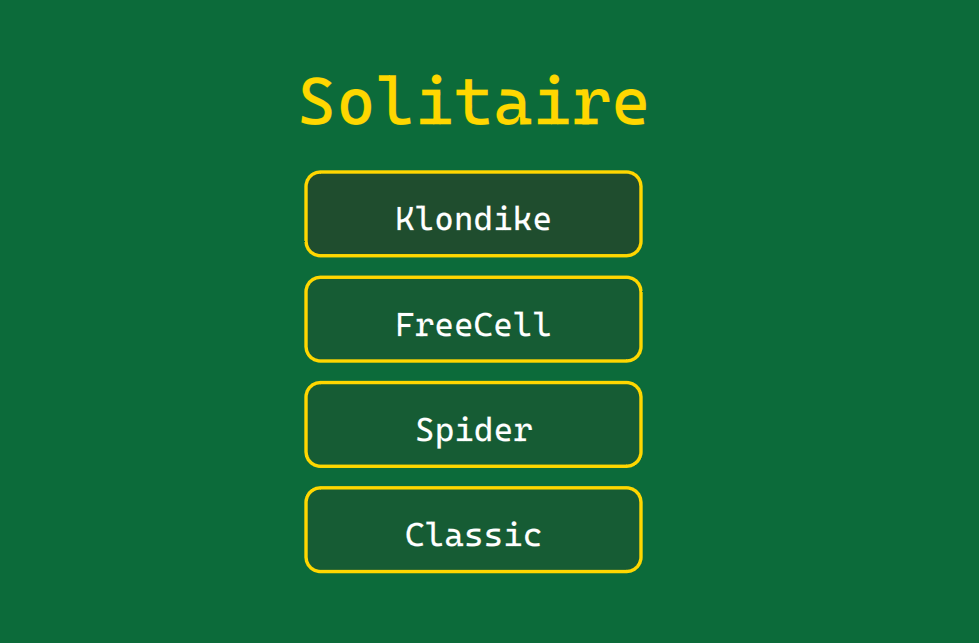

# Solitaire

[](https://buymeacoffee.com/larsbrubaker)

[](https://larsbrubaker.github.io/solitaire/)

> **▶︎ [Play it in your browser](https://larsbrubaker.github.io/solitaire/)**

Four solitaire variants in Rust — rendered with [agg-gui](https://github.com/larsbrubaker/agg-gui), persisted to Supabase, runs natively (winit + wgpu) and in the browser (WebAssembly).

The four games:

- **Klondike** — classic 7-tableau / 4-foundation / 1-stock / 1-waste solitaire (1-card draw).
- **FreeCell** — 8 cascades / 4 free cells / 4 foundations. No stock; multi-card moves gated by free-cell count.
- **Spider** — 10 cascades / 8 foundations / 2 decks. Single-card moves accept any suit; multi-card requires a suited descending tail. Complete K→A suited runs auto-collapse to a foundation.
- **Classic** — Microsoft-style Klondike variant ported from the [DualBrain VB.NET](https://github.com/DualBrain/Solitaire) original. 3-card draw.

The 3-game shell (Klondike, FreeCell, Spider) follows the [AvaloniaUI/Solitaire](https://github.com/AvaloniaUI/Solitaire) C# layout; **Classic** is a 4th option added on top.

## Quick start

```bash
# Native
cp .env.example .env          # fill in SUPABASE_ANON_KEY
cargo run -p solitaire-native
cargo dev                     # cargo-watch hot-reload (cargo install cargo-watch first)

# WebAssembly
wasm-pack build solitaire-wasm --target web --out-dir ../demo/public/pkg --no-typescript
cd demo && bun install && bun run dev
```

## Controls

- **Drag** any face-up card (or a valid descending tail) to a legal pile.
- **Double-click** a face-up card to send it straight to a foundation when there's a legal target — the standard solitaire shortcut.
- **Click** the stock pile to deal (1 card in Klondike, 3 in Classic, 10-card broadcast in Spider). When the stock is empty in Klondike/Classic, clicking it recycles the waste back face-down.
- **Undo** / **New Deal** / **Title** in the bottom HUD strip.

## Workspace layout

```
solitaire-core/    # game logic, widgets, Supabase REST client (target-agnostic)
solitaire-native/  # winit + wgpu shell
solitaire-wasm/    # cdylib wasm-bindgen shell
demo/              # TypeScript bundling shell for the WASM build
reference/         # AvaloniaUI + DualBrain reference repos (read-only; gitignored)
```

`solitaire-core` is `wasm32`-clean — no `tokio`, no `dotenvy`. Both shells inject `Storage` impls.

Card faces are **drawn procedurally** through agg-gui's `DrawCtx` and pre-rasterised once into 53 sprites at the current physical-pixel scale; the wgpu backend keys textures by `Arc::as_ptr` so duplicate sprites share one GPU texture.

## Database

Schema is shared with [Antidote](https://github.com/larsbrubaker/antidote): `games`, `user_scores (user_id, game_id) PK`, `user_progress`, `user_settings`. Same Supabase project; new rows in `games` for slugs `klondike`, `freecell`, `spider`, `classic`.

Auth: Supabase email/password via REST. Tokens cached in a JSON file on native, `localStorage` in the browser. RLS enforces `auth.uid() = user_id` on user-scoped tables.

## Status

| Phase | Description | State |
|-------|-------------|-------|
| 0 | Repo scaffold + CI + Pages deploy | done |
| 1 | Card framework (cards, piles, session, render) | done |
| 2 | Klondike | done |
| 3 | FreeCell | done |
| 4 | Spider | done |
| 5 | Classic | done |
| 6 | Persistence + leaderboard | pending |

## License

MIT — see [LICENSE](LICENSE).

---

Part of the [rust-apps](https://github.com/larsbrubaker/rust-apps) suite — a collection of Rust graphics and geometry libraries by Lars Brubaker.
